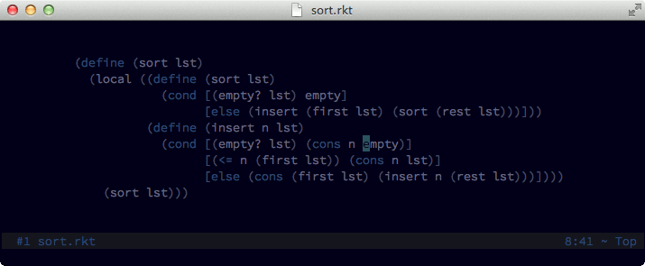

## wildfire.vim

With *Wildfire* you can quickly select the closest text object among a group of
candidates. By default candidates are `i'`, `i"`, `i)`, `i]`, `i}`, `ip` and `it`.

Learn more about text objects with `:help text-objects`.



### Usage

Press `<ENTER>` in normal mode to select the closest text object. Keep pressing
`<ENTER>` for selecting the **next** closest text object. To go the other way
round, that is, to select the **previously** selected text object, press `<BS>`.

To speed things up, if you want to select the `n`th closest text object you can
press a number followed by `<ENTER>` (e.g. pressing `2<ENTER>` will select the
second closest text
object).

To change default mappings use the following options:

```vim
" This selects the next closest text object.
let g:wildfire_fuel_map = "<ENTER>"

" This selects the previous closest text object.
let g:wildfire_water_map = "<BS>"
```

By default, *Wildfire* selects any of the text objects `i'`, `i"`, `i)`, `i]`,
`i}`, `ip` and `it`. You can decide the ones to consider with the following
option:

```vim
let g:wildfire_objects = ["i'", 'i"', "i)", "i]", "i}", "ip", "it"]
```

### Advanced setup

Sometimes considering certain kinds of text objects can be quite annoying. This
is the case of Html, where, for example, you may want to select just tag objects.

Wildfire allows you to be selective about which text objects are considered with
different filetypes:

```vim
" use '*' to mean 'all other filetypes'
" in this example, html and xml share the same text objects
let g:wildfire_objects = {
    \ "*" : ["i'", 'i"', "i)", "i]", "i}", "ip"],
    \ "html,xml" : ["at"],
\ }
```
